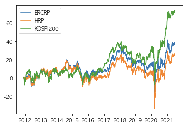
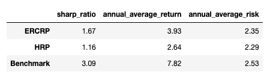
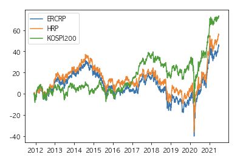
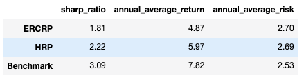

# 금융공학및위험관리 팀프로젝트
- ERCRP 모델 구현 
- HRP 모델 구현
- 백테스팅을 통한 Benchmark와의 성능 비교

## 방법

- 2011.06 ~ 2021.06 
- KOSPI 상장 전체 종목 (상장 폐지 종목 포함)
- 인버스 ETF 제외

## 결과

1. 시가 총액 상위 30개 종목 기반 RP 구성
   - 누적 수익률 그래프
   - 
   - 평가 지표
   - 

2. 시가 총액 상위 10개 종목 기반 RP 구성
   - 누적 수익률 그래프
   - 
   - 평가 지표
   - 

